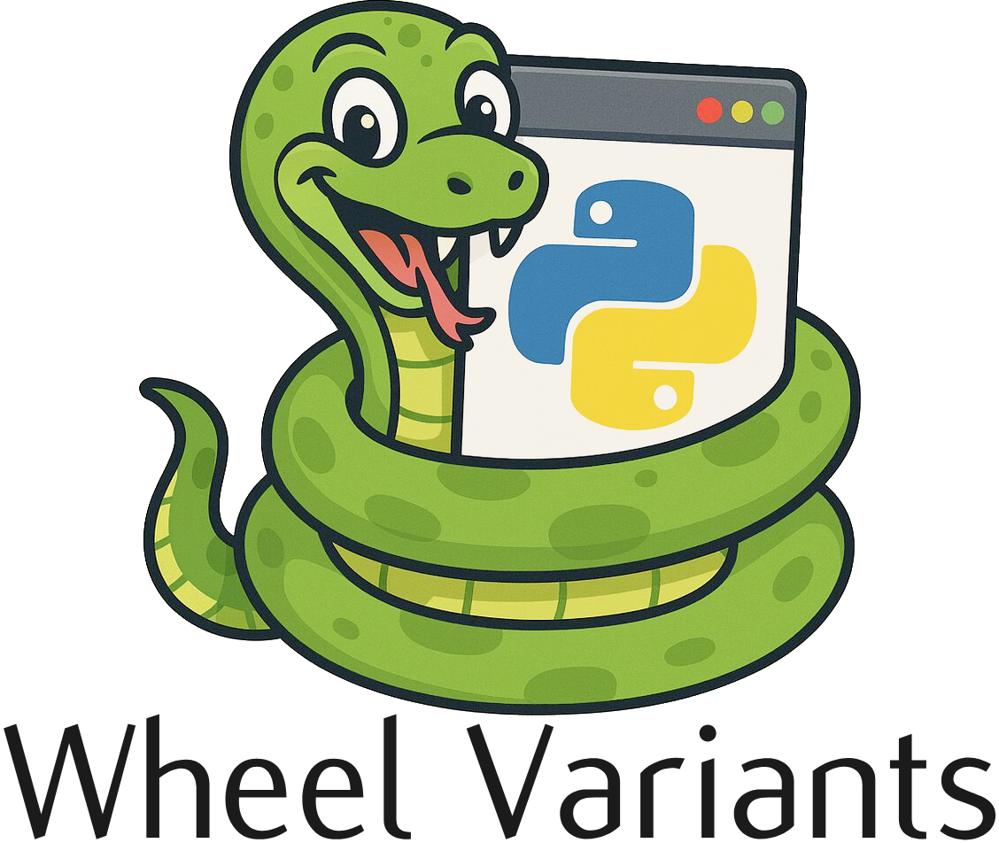

<h1 style="text-align:center; font-size: 5em">Wheel Variants</h1>

    

  
  
  

  

# Wheel Variant Tutorials

## Installation Tutorials

**The following tutorials are available:**

| Project |               Link                | Linux x86_64 | Linux AARCH64 | Windows AMD64 | MacOS x86_64 | MacOS ARM64 |
| :-----: | :-------------------------------: | :----------: | :-----------: | :-----------: | :----------: | :---------: |
|  Numpy  |  [Link](docs/tutorials/Numpy.md)  |      ✅      |      ✅       |      ✅       |      ✅      |     ✅      |
| PyTorch | [Link](docs/tutorials/PyTorch.md) |      ✅      |      ❌       |      ✅       |      ❌      |     ❌      |
| XGBoost | [Link](docs/tutorials/XGBoost.md) |      ✅      |      ❌       |      ✅       |      ❌      |     ❌      |

## Package Building Tutorials

|   Project    |                  Link                  |
| :----------: | :------------------------------------: |
| Meson-Python | [Link](docs/tutorials/meson-python.md) |
|     Flit     |                                        |
|   CLI API    |                                        |
